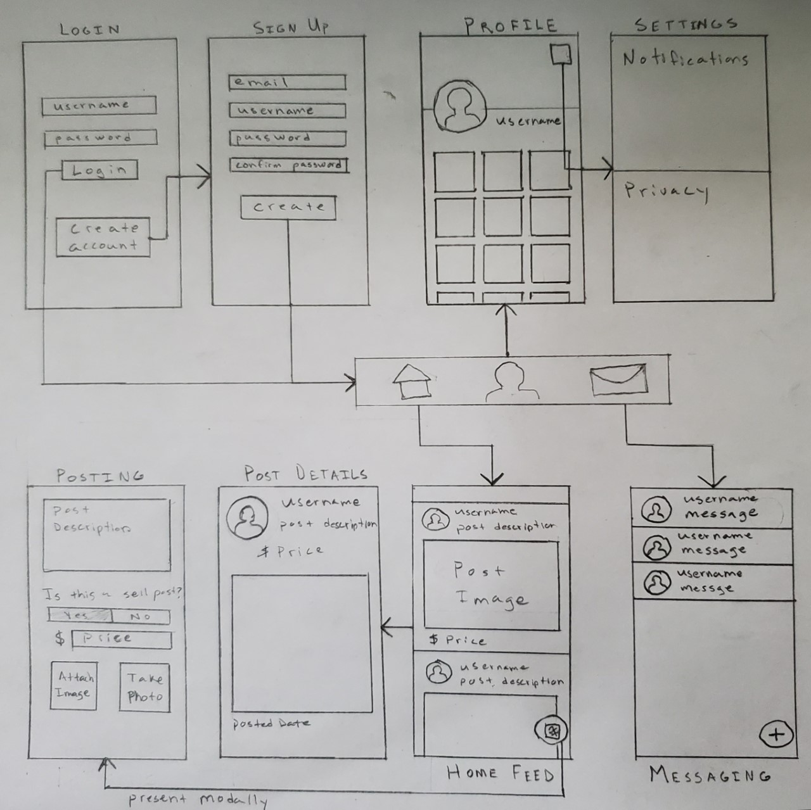
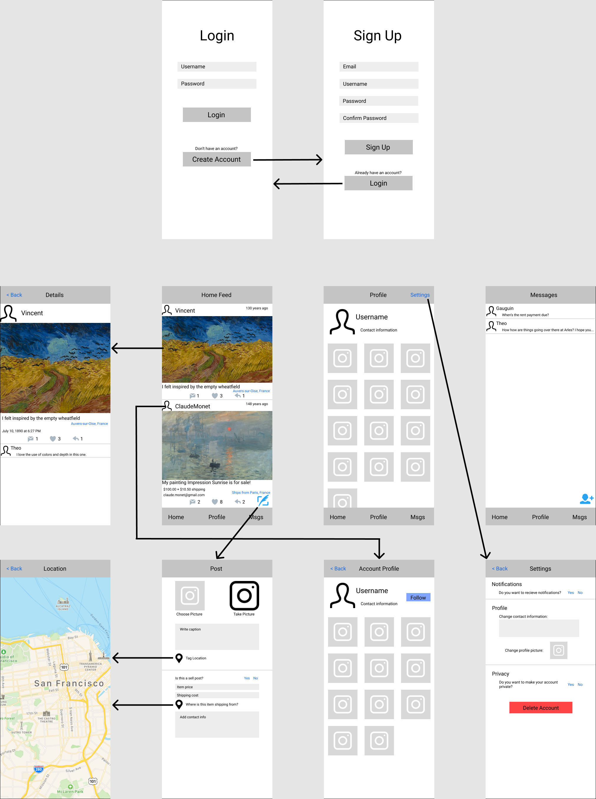

# INSERT APP NAME

## Table of Contents
1. [Overview](#Overview)
2. [Product Spec](#Product-Spec)
3. [Wireframes](#Wireframes)
4. [Schema](#Schema) 

## Overview
### 1. Description
An app that allows artist to showcase their work and sell it. Users can follow other artists to see their posts show up in their home feed. When a user creates a post, they can select if they want to display it as a ‘for sale’ item.  

### 2. App Evaluation
- **Category:** Social Networking / Art / Shopping
- **Mobile:** It would be developed for mobile only at first, but with a web version coming in the future. Both the mobile and web version would have the same content and features. 
- **Story:** Allows artists to display and sell their work. Allows art enthusiasts to view and purchase art. 
- **Market:** Visual artists (painters, sculptors, digital artists, photographers, etc..) and art enthusiasts. 
- **Habit:** The app would really benefit from users creating a habit of using the app daily like and interacting with other users. 
- **Scope:** The main part of this app would be for users to be able to see the posts from the users that they follow in their home feed. For the user's profile it should show their username, profile picture, contact information and a button to follow the account. When posting the user can select between making a regular post and a sell post. Regular posts show the username, profile picture, an image, a caption, when the post was created, and if the user wants it, it shows the location where the post was created. A sell post will show everything in a regular post, but it will also show the user's contact information, the items price, shipping cost, and where its shipping from. 

## Product Spec
### 1. User Stories (Required and Optional)

**Required Must-have Stories**

- [ ] User can create an account and log in
- [ ] Profile pages for each user
- [ ] User can create a post with a photo and caption
- [ ] User can follow other accounts
- [ ] User in their home feed can see posts from the accounts that they follow
- [ ] When posting user can select between making a regular post or a sell post, and create a sell post
- [ ] When creating a post, the user can tag the location 

**Optional Nice-to-have Stories**

- [ ] Multi image posts
- [ ] Liking posts
- [ ] Sharing posts
- [ ] Commenting on posts
- [ ] Profile shows all of the users posts using a collection view
- [ ] Private messages

### 2. Screen Archetypes

* **Login**
   * User Logs in into their account and their log in persists, so they don't have to do it every time the open the app.
* **Sign Up**
   * User inputs all their information, creates an account and is automatically logged in.
* **Home Feed**  
   * Shows posts from the accounts that the user is following, uses table view.
      - Regular Post - shows the profile picture, username, post creation date, an image, a caption, and if the user selects it, the location where to post was created
      - Sell Post - shows everything in the regular post, the user's contact information, the items price, shipping cost, and where its shipping from.
      - Liking posts - users can like other account's posts, the post shows a like count.
      - Commenting on posts - users can comment on other account's posts, anyone can see the comments on the posts, the post shows a comment count.
      - Sharing posts - users can share other account's posts, when they share a posts it shows up on the feed of the users followers, the post shows a shared count.
* **Post Details** 
   * Shows the post in a full screen view and allows user to comment.
* **Posting**  
   * Post are image based with a text caption; the user can select between making a regular post or a buy post.
* **Profile**  
   * Shows their username, profile picture, contact information and a button to follow the account if they're not looking at their own profile.
* **Messaging** 
   * Users can message each other without the need to be mutually following each other.
* **Settings** 
   * Lets the user change notification and privacy settings.

### 3. Navigation

**Tab Navigation** (Tab to Screen)

* Home Feed
* Profile

**Optional**
* Messaging

**Flow Navigation** (Screen to Screen)
* Login - Opened if the user has not registered an account, user puts their username and password to login.
    * -> Sign Up - User creates an account by entering their email, username, and password twice.
* Home Feed - Shows posts form the accounts the user is following.
    * -> Post Details - User can tap on post to view details or comment.
    * -> Posting - Button that allows user to create a post.
* Profile - User can modify ther profile picture image, and contact information.
    * -> Settings - User can modify notification and privacy settings.
* Messaging - User can send messages to the accounts that they're are following.

### 4. App Expectactions
- [x] Your app has multiple views
- [x] Your app interacts with a database - I'll be using Parse for the backend 
- [x] You can log in/log out of your app as a user
- [x] You can sign up with a new user profile
- [x] Somewhere in your app you can use the camera to take a picture and do something with the picture - When creating a post the user can use the camera and add that picture to the post
- [x] Your app integrates with a SDK - [iOS MapKit SDK](https://developer.apple.com/documentation/mapkit) with [Foursquare API](https://developer.foursquare.com/), used for taggin locations on posts
- [ ] Your app contains at least one more complex algorithm 
- [x] Your app uses gesture recognizers - double tap image to like and/or pinch zoom for images
- [x] Your app use an animation - transition animation when tapping post button in home feed
- [x] Your app incorporates an external library to add visual polish - custom loading pop ups with [MBProgressHUD](https://github.com/jdg/MBProgressHUD)

## Wireframes

 

## Schema 

### 1. Models

#### Post

   | Property      | Type     | Description  |
   | ------------- | -------- | ------------ |
   | objectId      | String   | unique id for the user post (default field) |
   | author        | Pointer to User| image author |
   | image         | File     | image that user posts |
   | caption       | String   | image caption by author |
   | hasLocation   | Boolean  | says whether the user wants the location displayed or not |
   | location      | Dictionary | shows where the art is located |
   | commentsCount | Number   | number of comments that has been posted to an image |
   | likesCount    | Number   | number of likes for the post |
   | sharedCount   | Number   | number of times the post has been shared |
   | createdAt     | DateTime | date when post is created (default field) |
   | updatedAt     | DateTime | date when post is last updated (default field) |
   
#### Sell Post (Inherits from Post)

   | Property       | Type       | Description  |
   | -------------- | ---------- | ------------ |
   | contactInfo    | String     | users contact information |
   | price          | Number     | price of the item being sold |
   | shppingCost    | Number     | shipping cost for the item |
   | originLocation | Dictionary | location that the item is shipping from |
   
### 2. Networking

#### List of network requests by screen
   
   - Home Feed 
      - (Read/GET) Query all posts of accounts the user is following
      - (Create/POST) Create a new like on a post
      - Optional
        - (Create/POST) Like a post
        - (Delete) Delete existing like
        - (Create/POST) Create a new comment on a post
        - (Delete) Delete existing comment
        - (Create/POST) Share a post
        - (Delete) Un-share a post
   - Posting 
      - (Create/POST) Create a new post object
      - (Create/POST) Create a new sell post object
   - Post Details 
      - Optional
        - (Create/POST) Like a post
        - (Delete) Delete existing like
        - (Create/POST) Create a new comment on a post
        - (Delete) Delete existing comment
        - (Create/POST) Share a post
        - (Delete) Un-share a post
   - Profile 
      - (Read/GET) Query logged in user object
      - (Read/GET) Query all posts where user is author
      - (Update/PUT) Update user profile image
